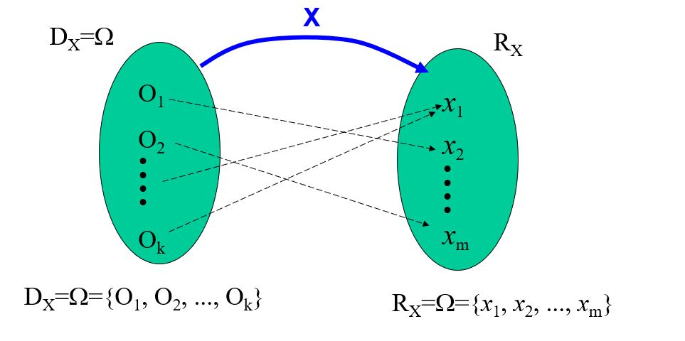

```{r setup, include=FALSE,comment=FALSE}
knitr::opts_chunk$set(echo = TRUE)
```

# Variables aleatorias

Es una funcion cuyo dominio es un espacio muestral, cuyo rango es un subconjunto de los numeros reales

variable x

aleatoria x

convencionalismo

dom(FUNCIóN o variable aleatoria)= Ω espacio muestral (es el conjunto de resultados posibles de un experimento o de un fenomeno aleatorio)



**Ω espacio muestral Son transformados a través de la funcion (variable aleatoria) en numeros**

Ω espacio muestral(texto,numero,caracteres,textocon numero )

A traves de esa transformacion se puede obtener 2 tipos de variable


**Variables continuas**

Son aquellas cuyos rangos forman conjuntos no numerables Ejemplos:

*Cantidad de combustibles consumido por dia* Peso de un producto


# Variables aleatorias discretas 

Son aquellas cuyos rangos formas conjuntos numerables pueden contener un numero finito o infinito de elementos 

Ejemplo :

*Número de fallas por cada metro de un tejidos.

*Número de articulos defectuosos producidos.

## Función de probabilidad o funcion de densidad

**En R dnorm()**

Sea X una variable aleatoria discreta que tiene rango Rx(conjunto de valores que asume la variable aleatoria)

Una función f(x) es llamada funcion de probabilidad de variable aleatoria X si tiene como dominio a Rx(conjunto de valores que asume la variable aleatoria) y como rango un conjunto numero reales que 
cumplen las siguientes probabilidades.

**Ejemplo:**

Supongamos que tenemos 2 tetraedros y en que en cada una de sus caras estan numeradas del 1 al 4

T1 -\> {1,2,3,4}

T2 -\> {1,2,3,4}

Experimento E: Se aplica el experimento de lanzar los 2 tetraedros

E:Lanzar 2 tetraedros\
$Ω:{(1,1);(2,1);(3,1);(4,1);(1,2);(2,2),(3,2);(4,2);(1,3);(2,3);(3,3);(4,3);(1,4);(2,4);(3,4);(4,4)}$

```{r}
T1 <-as.character(c(1:4))
T2 <-as.character(c(1:4))
espacio_muestral <- expand.grid(T1,T2)
espacio_muestral
nrow(espacio_muestral)#cardinal
```

**Definimos una variable aleatoria**

X:Diferencia en valor absoluto de los 2 valores que aparecen (variable aleatoria)


X(1,1)=0  P(X(1,1))=1/16 

X(2,2)=0  P(X(2,2))=1/16  

X(3,3)=0  P(X(3,3))=1/16 

X(4,4)=0  P(X(4,4))=1/16
 
P(X=0)=4/16 
          

X(1,2)=1 P(X(1,2))=1/16  

X(2,1)=1 P(X(2,1))=1/16 

X(2,3)=1 P(X(2,3))=1/16 

X(3,2)=1 P(X(3,2))=1/16 

X(3,4)=1 P(X(3,4))=1/16 

X(4,3)=1 P(X(4,3))=1/16 

P(X=1)=6/16 
         
         
X(1,3)=2 P(X(1,3))=1/16

X(3,1)=2 P(X(3,1))=1/16

X(2,4)=2 P(X(2,4))=1/16

X(4,2)=2 P(X(4,2))=1/16

P(X=2)=4/16
         

X(1,4)=3 P(X(1,4))=1/16

X(4,1)=3 P(X(4,1))=1/16

P(X=3)=2/16

**Propiedades Función de probabilidad **

$$0\leq P[X=x_{i}]=f(x_{i}), \forall x_{i}\in \mathbb R$$

|        |      |     |     |     |
|--------|------|-----|-----|-----|
| X      | 0    |1    |2    |3    |
| P(X=x) | 4/16 |6/16 |4/16 |2/16 | = f(xi)


Dominio $f(x_{i})$ : {0,1,2,3} (conjunto de valores que asume la variable aleatoria)

Rango              : { 4/16 ,6/16, 4/16 ,2/16} probabilidad de ocurrencia que tienen variables aleatorias

$$0\leq f(x_{i})\leq 1 ,\forall x_{i}\in \mathbb R$$

$$\sum_{x_{i}\in \mathbb R}f(x_{i})=1$$
```{r}
sum(c(4/16,6/16,4/16,2/16))
```


```{r}
fx <- c(4/16,6/16,4/16,2/16)
X <- c(0,1,2,3)
```

```{r}
plot(X,fx,type="h") 
```
```{r}
library(ggplot2)
ggplot() + aes(x=X,y=fx) + 
  geom_bar(stat="identity",width = 0.01,color="red")
```

SE DEBE PONER UN GRAFICO DE VARAS (se debe colocar la perpendicular en el valor (no una barra))


## Funcion probabilidad acumulada  FPA

Sea X una variable aleatoria discreta que tiene como  funcion probabilidad f(x); luego, la 
funcion de probabilidad acumulativa de la variable aleatoria X  se define como :

$$F(x)=P[X \leq x]=\sum_{x_{i}\leq x}f(x_{i})$$
**Propiedades**


$$F(x)=0,\forall x< m, m=Min,x\in R_{x}$$
$$F(x)=1,\forall M\leq x , M=Min,x\in R_{x}$$
$$0\leq F(x)\leq 1 ,\forall x_{i}\in \mathbb R$$
$F(x)$ es una función no decreciente.


# Variables aleatorias continuas


$$0\leq f(x_{i}), \forall x_{i}\in \mathbb R$$


dom (valores que puede tomar x) 

rango( valores que puede tomar y)

fenomeno: Es una actividad en la cual solo nos limitamos a observar 

experimento :Es aquella actividad que ejerces algun tipo de control manejando la variables y la caracteristicas.

dicretos (su recorrido es numerable,se puede contar ) 

continua  :(no se puede contar solo medir no es finito )


# Valor esperado

Valor esperado o esperanza matemática

Es el valor promedio que esperariamos encontrar por 


|        |      |     |
|--------|------|-----|
| X      | 2    |5    |
| P(X=x) | 4/5  |1/5  |

**Función de probabilidad o funcion de densidad**

$$f(x) = \left\{\begin{array}{lr}4/5   &  x=2\\1/5 &  x=5 \\ 0 & cc \\\end{array}\right.$$


**Función de probabilidad acumulada**

$$F(x) = \left\{\begin{array}{lr}0   &  x<2\\4/5 &  2\leq x<5 \\ 1 & 5\leq x \\\end{array}\right.$$ 

Se lanza una moneda a la vez si sale cara 
gano 2 soles y si sale sello gano 5 soles

* 1vez  2     2/1 =2
* 2vez  2     4/2 =2
* 3vez  2     6/3 =2
* 4vez  2     8/4 =2
* 5vez  5     13/5 =2

* 1000  2     .2.6..

# Distribuciones  discreta
Son las funciones de probabilidas asociadas a variables aleatorias 
discretas,que se generan mediante procesos de conteo sobre las 
veces que se repite un suceso.

Cuando se elige al azar un elemento, se averigua si cumple o no con 
cierta condición,para luego contar el número de elemento que si cumplen 
con la condicion en  analisis.


variables aleatorias discretas: cuando su recorrido es finito numeral

## Distribucion Bernulli

Un experimento aleatorio es llamado una prueba o ensayo de Bernoulli 
si cumple las siguientes condiciones:

1.Para cada prueba o ensayo se define un **espacio muestral** con solo **2 resultados posibles**:
**Exito(E)** y **Fracaso(F)**.


Donde : 

$\pi$=Probabilidad de éxito

X=Número de exitos en una prueba Bernoulli 

$$P(E)=\pi$$
$$P(F)=1-P(E)=1-\pi$$
2. La probalidad de exito($\pi$) se mantiene constante de prueba a prueba

3. Las pruebas se consideran que son independientes

(El resultado cada experimento se tiene que  realizar en las mismas condiciones)

**Función de probabilidad de una distribucion Bernulli**

$$P(X = x)=f(x) = \left\{\begin{array}{lr} \pi^x(1 - \pi)^{1-x}  &  x =0,1\\0 &  cc  \\\end{array}\right.$$

$$\pi =Exito/Total$$
**1 : Exito**
 
**0 : Fracaso**

Además, la media  y variancia de la variable aleatoria X son :       

$$\mu_{X}=E[X]=\pi$$
$$\sigma^2_{X}=E[X^2]-(E[X])^2=\pi-\pi^2=\pi(1-\pi)$$

**Comprobacion utilizando la formula de la valor esperado si X es una variable aleatoria discreta**

* Discreta 

|             |      |     |
|-------------|------|-----|
|      X      |  0   | 1   |
| f(x)=P(X=x) | 1-π  | π   | 

$$E(X)=\sum x_if_X(x_i)$$
$E(X)=0(1-\pi)+1(\pi)$

$E(X)=\pi$

$\mu_{X}=E(X)$

$\sigma^2_{X}=Var[X]=E[X-\mu_{X}]^2=E[X^2]-\mu_{X}^2=E[X^2]-(E[X])^2 =\pi(1-\pi)$

$E(X^2)=0^2(1-\pi)+1^2(\pi)$

$E(X^2)=\pi$

$\sigma^2_{X}=E[X^2]-(E[X])^2=\pi-\pi^2=\pi(1-\pi)$


## Distribucion Binomial

Una variable aleatoria discreta X tiene un distribucion Binomial si su función  de probabilidad es dada por

$$P(X = x)=f(x) = \left\{\begin{array}{lr} \binom nx \pi^x(1 - \pi)^{n-x}  &  x =0,1..,n\\0 &  cc  \\\end{array}\right.$$
$$P(X = x)=f(x) = \binom nx \pi^x(1 - \pi)^{n-x} \quad  x =0,1..,n$$

Donde:

$\pi$= Probabilidad de exito

$n$=Número de pruebas de Bernoulli  o tamaño 
de una muestra con reemplazo

X=Numero de exitos en "n" pruebas de Bernoulli

Además,la media y variancia de la variable aleatoria X son :

$$\mu_{X}=E[X]=n\pi$$
$$\sigma^2_{X}=E[X^2]-(E[X])^2=n\pi-n\pi^2=n\pi(1-\pi)$$
**Cuando tienes 2 resultados posibles y el experimento en las mismas condiciones se repite n veces** 


### Combinatoria

Dado un conjunto de N objetos distintos, cualquier subconjunto no ordenado de tamaño n de los objetos se llama combinación
y se dentota de las siguiente manera.
(no existe reemplazo)


$$\binom nx = \frac{n!}{x!(n-x)!}$$
Ejemplo :

Supongamos que se esta en un micro JUAN,MARIA,ELENA,PEDRO,DAVID,ANA
Si se define la variable aleaotoria el número de personas que se contagian.

```{r}

n <- 6
x <- 2
choose(n, x)
```
```{r}
personas <- c("JUAN","MARIA","ANA","ELENA","PEDRO","DAVID")
```

Todos los  arreglos en la que 2 personas se contagian 

```{r}
library(gtools)
combinations(n=6, r=2, v=personas)
```

Rpta: Son 15 arreglos de que 2 personas se contagien 

Cual es la probabilidad de ANA Y ELENA se contagien 

$$\pi=1/15$$
```{r}
1/choose(6,2)
```

$$P(X = x)=f(x)=\binom nk\pi^x(1-\pi)^{n-x}$$
$$P(X = 2)=f(2)=\binom 62\pi^2(1-\pi)^{6-2}$$
```{r}
choose(6,2)*(1/15)^2*(1-(1/15))^(6-2)
```
```{r}
dbinom(2,6,(1/choose(6,2)))
```


### Permuntación 
Cualquier secuencia ordenada de n objetos tomados de un conjunto de N objetos distintos se llama permutación

$$P_{n}^N=n!\binom Nn=  \frac{N!}{(N-n)!}$$
```{r}
factorial(5)/factorial(5-2)
```


```{r}
library(gtools)
permutations(6, 2,v=personas,repeats.allowed = F)
nrow(permutations(6, 2,v=personas,repeats.allowed = F))
```

## Distribucion Poisson

Una variable aleatoria discreta X tiene una distribución de Poisson si su
función de probabilidad es dada por :


$$P(X = x)=f(x) = \frac{e^{-\mu}\mu^x}{x!}  \quad  x =0,1,2...\\ 0 , \quad cc  $$
Donde:

e= 2718281...cte euler

X=Número de exitos obtenidos en un período o unidad de evaluación.

$\mu=\lambda $ (Tasa promedio de ocurrecia de eventos en un periodo t)


$\lambda=$ es el valor medio esperado en cierto lapso de tiempo. Algunas veces expresado como 


Ademas,la media y variancia:
$$\mu_{X}=E[X]=\mu$$
$$\sigma^2_{X}=Var[X]=E[X^2]-(E[X])^2=\mu$$
Para la aplicaión  de esta distribución es necesario tener en cuenta los siguientes supuestos

1. La tasa promedio de ocurrencia se mantiene constante y es pequeña.

2. El número de ocurrencias en cualquier intervalo ,periodo o unidad de tiempo es independiente del 
número de ocurrencias en cualquier otro intervalo,periodo o unidad de evaluación.


## Distribucion Hipergeometrica 

Sea una población de tamaño N, donde hay A elementos que tienen una carateristica  W definida como exito,y B elementos que no tienen caracteristica
W,siendo  N=A+B.Si de dicha poblacion se toma una muestra aleatoria  X tendra una muestra aleatoria de tamaño n y se define la variable aleatoria x czomo el 
número de éxitos obtenidos;entonces la variable X tendra como función de probabilidad.

$$f(x)= \frac{\binom Ax\binom B{N-x}}{\binom Nn},si\quad x=0,1,2,..,n \\ \text{(0,lo peor que puede suceder )}\leq x\leq \text{(lo mas optimo que puede suceder o n,A)}\\ 0 ,\quad cc$$

$$f(x)= \frac{\binom Ax\binom B{N-x}}{\binom Nn},si\quad x=0,1,2,..,n \\ max(0,n+A-N)\leq x \leq min(n,A) $$


N:Tamaño de poblacion 

n:Tamaño de muestra 

x:Numero de exitos obtenidos en una muestra sin reemplazo de tamaño n
(**x no siempre arranca de 0**)

Ademas,la media y varianza de la variable aleatoria X son

$$\mu_{X}=E[X]=\frac{nA}{N}$$

$$\sigma^2_{X}=Var[X]=\frac{nAB}{N^2}[\frac{N-n}{N-1}]$$


# Distribución continuas

Son las funciones de probabilidad asociadas a variables aleatorias continuas; es decir; para aquellas
variables cuyo rango es un conjunto infinito no numerable.


En una distribucion continua la funcion de densidad no representa probabilidad **(no existe probabilidad puntual)**


## Distribucion normal 

$$f(x)=\frac{1}{\sqrt{2\pi}\sigma} e^{-\frac{1}{2}(\frac{x-\mu}{\sigma})^2} \qquad \text{para todo x real}$$
$\pi=3.1416$

Donde:

$$\mu_{X}=E[X]=\mu$$
$$\sigma^2_{X}=Var[X]=\sigma^2$$


